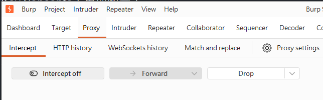

# Intercept HTTP Traffic（攔截 HTTP 流量）

> **Category（分類）**：Getting Started
>
> **Tool（工具）**：Burp Proxy
>
> **Objective（目標）**：學習如何攔截 Browser 與 Target Server 之間的 HTTP Traffic。

---

# Overview（概述）

Burp Proxy 會作為 Browser 與 Target Server 之間的 Proxy（代理伺服器）。

所有 Browser 發送的 HTTP Request 都會先經過 Burp，再決定是否 Forward 到目標 Server，因此可以查看、修改或分析封包內容。

---

# Learning Objectives（學習目標）


- 了解 Burp Proxy 的工作原理
- 設定 Browser Proxy
- 攔截 HTTP Request
- Forward Request 到 Server
- 查看 Raw HTTP Request

---

# Workflow（流程）

```text
Browser
    │
    ▼
Burp Proxy
    │
Intercept Request
    │
    ▼
Forward
    │
    ▼
Target Server
```

---

# HTTP Request（封包）

```http
GET / HTTP/1.1
Host: example.com
User-Agent: Mozilla/5.0
```

---

# Key Concepts（重要觀念）

## Proxy（代理）

位於 Client 與 Server 之間，所有流量都會先經過 Proxy。

---

## Intercept（攔截）

Burp 會暫停 HTTP Request，等待使用者決定是否 Forward。

---

## Forward（轉送）

按下 **Forward** 後，HTTP Request 才會送到 Server。

---

## Drop（丟棄）

直接捨棄 Request，不送到 Server。

---




# Notes（筆記）

- Intercept ON：攔截 Request
- Intercept OFF：直接通過
- HTTPS 需要安裝 Burp CA Certificate

---

# Summary（總結）

Burp Proxy 讓我們能夠在 Request 抵達 Server 前查看與修改內容，是 Web Security Testing 最重要的基礎功能。
